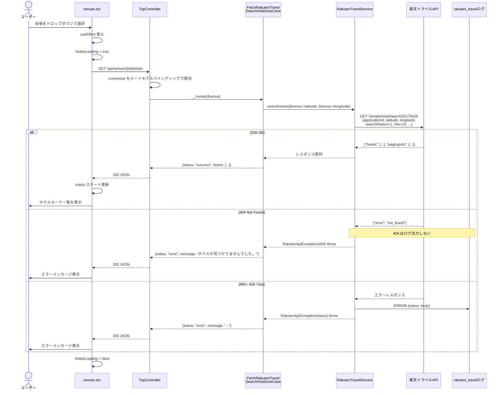

# 楽天トラベルホテル検索機能 仕様書

## 概要

会場（LiveVenue）選択時に、楽天トラベル SimpleHotelSearch API を使って会場から半径1km圏内のホテルを最大10件取得し、一覧表示する機能。

---

## システム構成

```
フロントエンド (venues.tsx)
    ↓ fetch /api/venues/{id}/hotels
TopController::getHotels()
    ↓ ルートモデルバインディング
FetchRakutenTravelSearchHotelUseCase
    ↓
RakutenTravelService
    ↓ Http::rakutenTravel() マクロ
楽天トラベル SimpleHotelSearch API（外部）
```

### 主要ファイル

| ファイル | 役割 |
|---|---|
| `app/Http/Controllers/TopController.php` | HTTPリクエスト受付・JSON返却 |
| `app/UseCases/FetchRakutenTravelSearchHotelUseCase.php` | ビジネスロジック統括 |
| `app/Services/RakutenTravelService.php` | 楽天API呼び出し |
| `app/Exceptions/RakutenApiException.php` | カスタム例外・ユーザー向けメッセージ |
| `app/Providers/RakutenTravelServiceProvider.php` | DIコンテナ登録・HTTPマクロ定義 |
| `app/Models/LiveVenue.php` | 会場データモデル（座標キャスト含む） |
| `routes/api.php` | APIルート定義（開発用モックを含む） |
| `config/services.php` | 楽天API設定 |
| `config/logging.php` | 専用ログチャネル設定 |
| `resources/js/pages/venues.tsx` | Reactフロントエンド |
| `tests/Feature/TopControllerTest.php` | フィーチャーテスト |

---

## シーケンス図



---

## API仕様

### 内部エンドポイント

| 項目 | 内容 |
|---|---|
| メソッド | `GET` |
| URL | `/api/venues/{venue}/hotels` |
| ルート名 | `venues.hotels` |
| 認証 | 不要 |

**パスパラメータ**

| パラメータ | 型 | 説明 |
|---|---|---|
| `venue` | integer | LiveVenue の ID（ルートモデルバインディング） |

**レスポンス**

```json
// 成功
{ "status": "success", "hotels": [...] }

// エラー
{ "status": "error", "message": "ホテルが見つかりませんでした。" }
```

### 楽天トラベル SimpleHotelSearch API

| 項目 | 内容 |
|---|---|
| ベースURL | `RAKUTEN_TRAVEL_BASE_URL`（環境変数） |
| エンドポイント | `/SimpleHotelSearch/20170426` |
| メソッド | `GET` |

**リクエストパラメータ**

| パラメータ | 値 | 説明 |
|---|---|---|
| `applicationId` | 環境変数 | 楽天アプリID |
| `accessKey` | 環境変数 | 楽天アクセスキー |
| `format` | `"json"` | レスポンス形式 |
| `latitude` | 会場の緯度 | 10進数表記（string） |
| `longitude` | 会場の経度 | 10進数表記（string） |
| `datumType` | `1` | 座標系（世界測地系） |
| `searchRadius` | `1` | 検索半径（km） |
| `hits` | `10` | 取得件数上限 |

**レスポンス構造**

```json
{
  "pagingInfo": { "recordCount": 10, "pageCount": 1, ... },
  "hotels": [
    {
      "hotel": [
        {
          "hotelBasicInfo": {
            "hotelNo": 136197,
            "hotelName": "ダイワロイネットホテル大宮",
            "hotelInformationUrl": "https://travel.rakuten.co.jp/HOTEL/136197/",
            "hotelMinCharge": 7500,
            "address1": "埼玉県さいたま市大宮区桜木町",
            "address2": "1-7-5",
            "access": "JR大宮駅西口より徒歩約3分",
            "nearestStation": "大宮",
            "hotelThumbnailUrl": "https://img.travel.rakuten.co.jp/...",
            "reviewCount": 382,
            "reviewAverage": 4.21
          }
        },
        {
          "hotelRatingInfo": { "serviceAverage": 4.3, ... }
        }
      ]
    }
  ]
}
```

---

## エラーハンドリング

| ステータスコード | ユーザー向けメッセージ | ログ出力 |
|---|---|---|
| 404 | ホテルが見つかりませんでした。 | なし |
| 400 | エラーが発生しました。 | あり |
| 429 | エラーが発生しました。時間を置いて再度お試しください。 | あり |
| その他 | サービスが利用できません。 | あり |

**ログ設定**

- チャネル: `rakuten_travel`
- ファイル: `storage/logs/rakuten_travel-{日付}.log`（14日間保持）

---

## フロントエンド

**表示フロー**

```
会場未選択 → ホテルセクション非表示
会場選択   → スケルトン表示（4枚） → API呼び出し
               ├─ 成功（hotels あり）  → ホテルカード一覧
               ├─ 成功（hotels 空）    → 「周辺にホテルが見つかりませんでした」
               └─ エラー              → エラーメッセージ
```

**ホテルカード表示項目**

| 項目 | フィールド |
|---|---|
| サムネイル | `hotelThumbnailUrl` |
| ホテル名（リンク） | `hotelName` → `hotelInformationUrl` |
| アクセス | `access` |
| 最寄り駅 | `nearestStation` |
| 評価 | `reviewAverage` + `reviewCount` |
| 最低料金 | `hotelMinCharge`（¥表示） |

**TypeScript型定義**

```typescript
type HotelBasicInfo = {
    hotelNo: number;
    hotelName: string;
    hotelInformationUrl: string;
    hotelSpecial: string;
    hotelMinCharge: number;
    address1: string;
    address2: string;
    access: string;
    nearestStation: string;
    hotelThumbnailUrl: string;
    reviewCount: number;
    reviewAverage: number;
};

type Hotel = { hotel: Array<{ hotelBasicInfo?: HotelBasicInfo }> };
```

---

## データモデル（LiveVenue）

| カラム | 型 | 説明 |
|---|---|---|
| `id` | bigint | 主キー |
| `name` | string | 会場名 |
| `prefecture` | string | 都道府県 |
| `capacity` | unsigned integer | 収容人数 |
| `nearest_station` | string | 最寄り駅 |
| `access` | string | アクセス情報 |
| `google_maps_url` | string | Google Maps URL |
| `latitude` | decimal(10,7) | 緯度 |
| `longitude` | decimal(10,7) | 経度 |
| `toilet_layout` | JSON | トイレレイアウト |

---

## 設定

**環境変数**

| 変数名 | 説明 |
|---|---|
| `RAKUTEN_TRAVEL_APP_ID` | 楽天APIアプリケーションID |
| `RAKUTEN_TRAVEL_ACCESS_KEY` | 楽天APIアクセスキー |
| `RAKUTEN_TRAVEL_BASE_URL` | APIベースURL |

**開発環境モック**

`routes/api.php` に本番以外の環境向けモックレスポンスを定義。楽天APIへの実リクエストなしにフロントエンド開発が可能。

---

## テスト

| テスト名 | 検証内容 |
|---|---|
| `test_index_returns_venues_page` | トップページが全会場データとともに表示される |
| `test_get_hotels_returns_hotel_data_for_venue` | APIモックを使って正常にホテルデータが返る |
| `test_get_hotels_returns_404_for_missing_venue` | 存在しない会場IDで404が返る |
| `test_get_hotels_returns_empty_when_service_fails` | レスポンスが空の場合に空配列が返る |
| `test_get_hotels_returns_error_when_api_throws_exception` | 400/404/429/500 各ステータスで適切なメッセージが返る |
